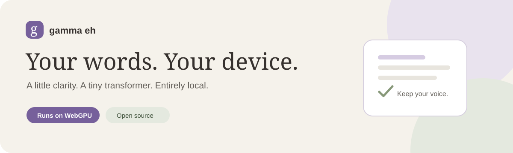
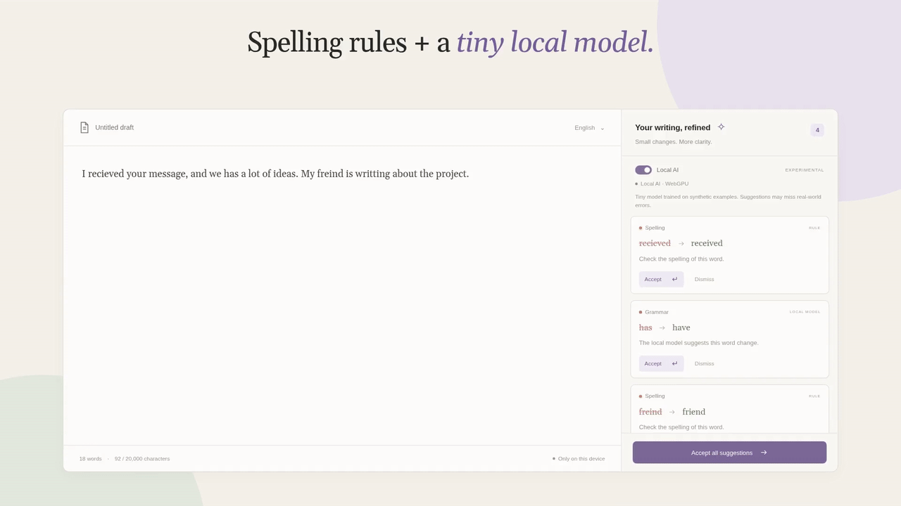
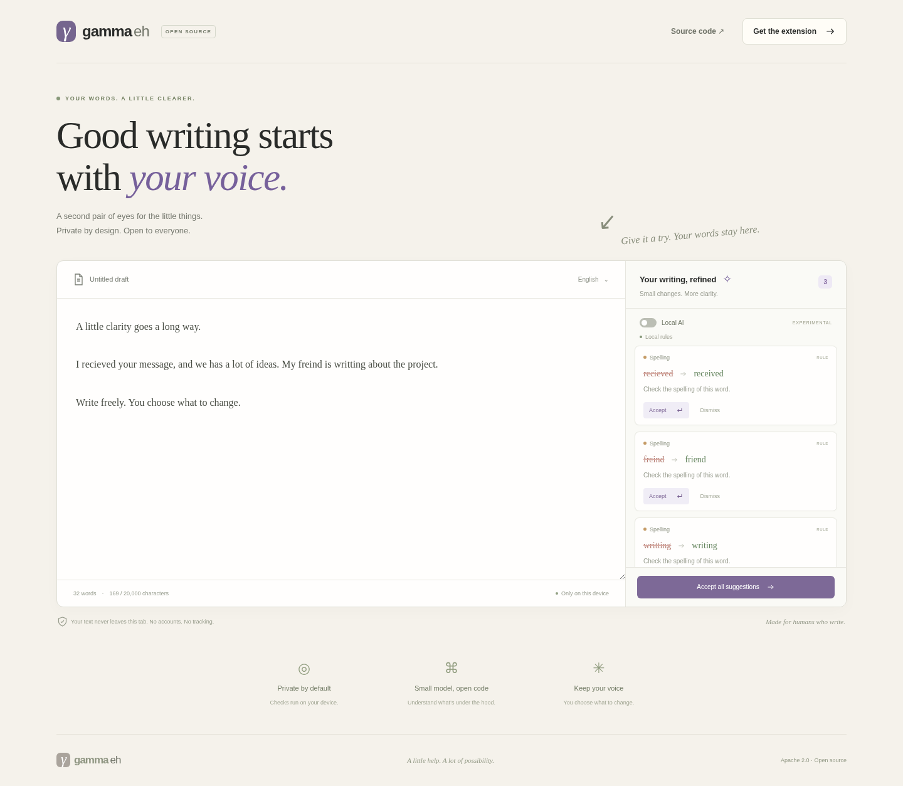

<h1 align="center">Gamma EH</h1>
<p align="center">An open-source English writing assistant.<br>A tiny transformer, running in your browser with WebGPU. Your text stays yours.</p>

<p align="center">
  <a href="https://github.com/thapecroth/gamma_eh/actions/workflows/check.yml"></a>
  <a href="#yes-we-ran-the-model-on-webgpu"></a>
  <a href="models/MODEL_CARD.md"></a>
  <a href="LICENSE"></a>
</p>

<p align="center">
  <a href="https://github.com/thapecroth/gamma_eh/releases">Downloads</a> ·
  <a href="#web-playground">Playground</a> ·
  <a href="#quickstart">Quickstart</a> ·
  <a href="#chrome-extension">Chrome extension</a> ·
  <a href="docs/README.md">Docs</a> ·
  <a href="#contributing">Contributing</a>
</p>

<p align="center">
  <br>
  <sub>🔊 <a href="docs/assets/gamma-eh-launch.mp4">Watch with sound (MP4)</a> · rendered from the real web editor and extension UI</sub>
</p>

Write freely. Review a suggestion. Keep what sounds like you.

Gamma EH combines spelling and grammar rules with a small, locally executed
transformer. Try it in the web editor or take it along with the Chrome extension.
Nothing changes until you accept a suggestion.

> [!IMPORTANT]
> Early, experimental software. The shipped model is trained on original synthetic
> templates, not a representative real-world grammar corpus. It proves the training
> and local-inference pipeline; it is not yet a general Grammarly replacement.
> Rules are on by default. **Local AI is opt-in.** Read the [model card](models/MODEL_CARD.md).

## Why Gamma EH?

| | What you get |
| --- | --- |
| **Local by design** | Bundled model and runtime. No account, API key, or inference server. |
| **WebGPU + WASM** | WebGPU where available; FP32 CPU inference as a fallback. |
| **A genuinely tiny model** | 4.38M parameters; 17.55 MB of FP32 weights, executed locally with JAX JS. |
| **You stay in control** | Accept or dismiss edits; source offsets and stale-text checks protect your draft. |
| **Ready on every website** | Suggestions run automatically. Pause individual sites or all sites; sensitive fields are excluded. |

<details>
<summary>See the editor — an actual local preview</summary>



This preview shows the default rules mode. Enable **Local AI** to try the
transformer; the interface reports the active WebGPU or WASM backend.

</details>

## Yes, we ran the model on WebGPU

Our trained ONNX model executes through **JAX JS WebGPU** in
both the web editor's worker and the Chrome extension's offscreen inference path.
That is verified execution, not just a `navigator.gpu` availability check.

[View the successful hosted E2E run](https://github.com/thapecroth/gamma_eh/actions/runs/36652624194)
at commit `6ef90a1`:

- A model-origin correction: “The students has a notebook.” → “The students have a notebook.”
- WASM fallback exercised; all 15 engine smoke cases matched the expected text.
- Extension edits, opt-out fields, pause/resume, and no external browser requests checked.
- 28 app tests and 17 dataset tests passed alongside lint, typecheck, and both builds.

> [!NOTE]
> The hosted WebGPU adapter was **SwiftShader software**, not a physical GPU.
> This verifies the WebGPU inference path, not hardware acceleration or latency.
> The 15 cases are engine smoke tests, not model-only or real-world accuracy scores.
> See [browser testing and remaining verification gates](docs/browser-testing.md).

## Web playground

Try Gamma EH without installing the Chrome extension. The web playground includes
example drafts, live spelling and grammar suggestions, optional local AI,
accept/dismiss, undo, reset, clear, and copy. All checks run on your device;
drafts stay in the tab and are discarded on reload.

After installing dependencies, run `npm run dev` and open the printed localhost
URL. No extension build is required. Choose **Try local AI** to enable the
experimental model, or use the Local AI switch. For static hosting and
extension-free browser verification, see [the playground guide](docs/playground.md).

## Quickstart

Requires **Node.js 24.11+ (24.x)** and npm. Vite+ is project-local; no global
installation is needed. The pretrained baseline is included.

```sh
git clone https://github.com/thapecroth/gamma_eh.git
cd gamma_eh
npm ci
npm run build
npm run dev
```

Open the address printed by Vite+. Flip **Local AI** on to try the experimental
model. Inference assets are local; executable code is never fetched from a CDN.

## Chrome extension

### Download and install

Ready-built packages belong on the [Releases page](https://github.com/thapecroth/gamma_eh/releases).
When a release is available, download **`gamma-eh-chrome-vX.Y.Z.zip`** from its
Assets section — not GitHub's automatically generated “Source code” ZIP.
No Node.js or build step is needed for the extension package.

1. Extract the ZIP into a folder you will keep on your computer.
2. Open `chrome://extensions` in Chrome 116 or newer and enable **Developer mode**.
3. Choose **Load unpacked** and select the extracted folder containing `manifest.json`.
4. Open or reload a regular website. Writing suggestions are enabled automatically.
5. Write in a textarea or plain-text contenteditable. Enable **Local AI** in the popup if desired.

This is a developer-mode installation, not a Chrome Web Store listing or a
one-click CRX installer. See [installation and updates](apps/extension/README.md)
and [release packaging](docs/releases.md).

### Build from source

After `npm ci` and `npm run build`, load `dist/extension` with the same steps.
The model and browser runtime are included in that folder.

The extension currently supports plain fields in the top frame. Google Docs,
rich document editors, shadow roots, and nested frames are not supported.
Page text is not uploaded or stored in extension settings.
Use the toolbar popup to **Pause on this site** or turn off **Writing suggestions**
everywhere. Chrome's site-access setting must allow the extension on all sites.

## Inside the model

| Component | Baseline |
| --- | --- |
| Architecture | BERT-Tiny edit classifier: 2 layers, hidden size 128, 2 attention heads |
| Parameters | 4,377,793 |
| Edits | 65 token-edit labels, confidence-gated suggestions |
| Context | Up to 64 WordPiece tokens per inference |
| Browser exports | FP32 ONNX for JAX JS WebGPU and WASM; INT8 retained for evaluation |
| Training data | Original, deterministic CC0 synthetic templates |

The shared engine combines model suggestions with rules and checks UTF-16
offsets before applying an edit. Workers keep inference off the UI thread.

[Architecture](docs/research-and-architecture.md) ·
[Training and provenance](docs/dataset-and-training.md) ·
[Model card and evaluation limits](models/MODEL_CARD.md) · [JAX JS runtime](docs/jax-js-runtime.md)

## Development

```sh
npm run check                 # lint → typecheck → tests → release tests → build
npx playwright install chromium
GAMMA_TEST_WEBGPU=1 npm run check:environment
GAMMA_TEST_WEBGPU=1 npm run test:browser
```

Run heavy jobs sequentially. Browser tests need a host that can launch Chromium
and bind localhost; see [the capability preflight](docs/browser-testing.md).
Use `npm run build`, not bare `vp build`, to bundle both apps and inference assets.

<details>
<summary>Train or generate a larger dataset</summary>

```sh
uv venv --python 3.10
uv pip install --python .venv/bin/python -r training/requirements.txt
.venv/bin/python training/data.py
.venv/bin/python -m pytest training
.venv/bin/python training/train.py --epochs 8
npm run build
```

Training uses CUDA when available. Seeds, source revisions, dataset hashes,
calibration, and evaluation evidence are recorded with the model.

For large teacher-generated runs, the resumable generator supports
OpenAI-compatible and Anthropic endpoints and defaults to a dry run.
[Scaling the dataset](docs/massive-dataset.md) covers generation and C4 imports.
Keep provider terms, provenance, and held-out evaluation separate; private pilot
datasets and checkpoints are not public release assets.

</details>

### Project map

| Path | Purpose |
| --- | --- |
| `apps/web` | React editor and inference worker |
| `apps/extension` | Manifest V3 popup, content script, offscreen inference |
| `packages/engine` | Rules, safe edit operations, tokenization, ONNX inference |
| `training` | Dataset generation, training, export, corpus safety tests |
| `models/browser` | Public baseline weights and provenance |
| `docs` | Research, validation, release runbook, roadmap |

## Contributing

This is an early open-source project. Help with grammar coverage, accessible
interfaces, independent evaluation, and browser compatibility is welcome.

- Start with the [roadmap](docs/roadmap.md) and [documentation index](docs/README.md).
- [Report an issue](https://github.com/thapecroth/gamma_eh/issues) with a minimal,
  fictional example. Please don't include private drafts or credentials.
- Use a branch and pull request, Conventional Commits, and focused tests.
  Document new infrastructure under `docs/`.

## License

Code and trained derivative model: [Apache-2.0](LICENSE). Original generated
corpus: CC0-1.0. Google's base checkpoint and bundled dependencies retain their
attributions; see [NOTICE](NOTICE).

An independent project, not affiliated with or endorsed by Grammarly.
