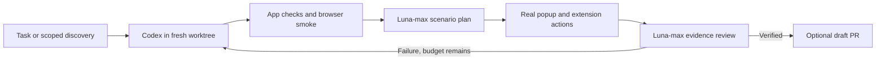

# Supervised local development loop

Gamma EH can run a bounded product-improvement cycle on your machine using your
existing Codex login. Codex edits product code; **GPT-6 Luna with maximum
reasoning** chooses additional extension scenarios and reviews their actual
browser evidence. Runs start manually. No recurring job is installed.



## Setup

Use Node 24.11+ in the 24.x line, npm, Git and the Codex CLI. Publication also
requires authenticated `gh` and push permission. The harness was validated with
Codex CLI 0.157.1 on Linux; process-group cleanup targets POSIX systems.

```sh
npm ci
codex login status
npx playwright install chromium
GAMMA_TEST_WEBGPU=1 npm run check:environment
```

Codex authentication stays in your existing local configuration. The harness
does not copy credentials into worktrees. It uses `codex exec` with ephemeral
sessions, structured output and explicit models; unrelated user MCP servers are
disabled with `--ignore-user-config`. There is no silent model fallback.
The coding default is `gpt-6-sol`, verified with this ChatGPT login on 2026-09-30.
The same login rejected `gpt-6.1-sol`; a cached model listing did not establish
account access. Use `--coding-model` or `GAMMA_CODEX_MODEL` to choose another
explicit, account-supported coding model. Luna stays pinned to `gpt-6-luna/max`.
See [official Codex CLI documentation](https://learn.chatgpt.com/docs/developer-commands#codex-exec)
and [GPT-6 Luna](https://developers.openai.com/api/docs/models/gpt-6-luna).

## Run and supervise

First run the deterministic popup suite, then let Luna plan additional cases:

```sh
npm run build
npm run test:extension
npm run agent:e2e
npm run agent:e2e -- --focus 'Exercise pause/resume around a spelling correction.'
```

The driver uses a fresh Chromium profile and fictional localhost fields. It
clicks the actual popup Enable button and checkboxes, and accepts/dismisses
suggestions in the extension's closed shadow panel. Required checks cover local
AI opt-in, rule and AI corrections, dismiss without mutation, pause/resume,
private/payment/opt-out fields, plain editable text, rich DOM preservation,
UTF-16 emoji offsets, and a stale suggestion after text changes.

Luna produces an allowlisted JSON action plan, limited to four scenarios and
48 actions. The browser controller executes it; Luna then reviews JSON evidence
and screenshots. Agent claims cannot waive failed browser assertions, missing
required cases, source changes or stale evidence. The browser has a four-minute
watchdog and a five-minute supervisor timeout. Agent calls and commands have
separate finite timeouts. Interrupting a run stops the active process group.

To supervise the complete loop without asking for edits, use a clean checkout:

```sh
GAMMA_TEST_WEBGPU=1 npm run agent:loop -- --verify-only
```

For development, pass one concrete task; without `--task`, Codex selects a small
product improvement from the roadmap. Default base is the freshly fetched
remote default branch. `--base HEAD` explicitly tests an unmerged local harness.

```sh
GAMMA_TEST_WEBGPU=1 npm run agent:loop -- \
  --task 'Fix one reproducible extension editing defect and add a regression test.' \
  --max-iterations 2
```

The loop retains its isolated worktree, diff and evidence for inspection. It
creates at most three coding attempts, running checks sequentially. Codex may
edit product apps/packages, regression tests and documentation; changes to
automation, package scripts, credentials, model assets or datasets stop the run.
Staged edits are checked too. Authentication/model failures stop rather than
triggering product repairs. No-op tasks produce no PR.

Append **`--publish`** when you want a verified change committed, pushed and
opened as a draft PR. PR publication requires matching source evidence from
every gate. The loop does not merge, release or deploy. Inspect the PR diff,
hosted checks and local evidence before merging. Scheduling remains a later
step after supervised manual runs; a timer should call the same bounded command.

## Evidence and failure handling

Each run prints its unique directory under `artifacts/agents/`. Inspect:

- `loop.json`: task, isolated worktree, attempts, gate results and final status.
- `iteration-N/e2e/report.json`: model, source hash, plan hash and completed phase.
- `plan.json` and `luna-review.json`: chosen scenarios and the evidence review.
- `browser/browser.json`, PNGs and `trace.zip`: observed actions and assertions.

Open a trace with `npx playwright show-trace <path-to-trace.zip>`. Private command
logs stay local with restricted permissions and are never put in a PR body.
Git ignores artifacts. Temporary browser profiles are removed, including after
a managed timeout. A shared lock in the Git common directory rejects overlapping
runs across worktrees. If a machine crash leaves `gamma-agent.lock`, inspect
`owner.json` and verify that its recorded process has stopped before removing it;
the harness never guesses that another run is stale.

CI and release packaging run the deterministic suite without Codex credentials.
Only its fictional browser evidence is uploaded. Local model/agent failures
remain visible separately from hosted browser checks.

## Boundaries

The test-only extension copy has a static localhost host grant; its source and
copied manifest hashes are recorded. This exercises the real popup activation
handler but **does not verify Chrome's native optional permission prompt or
revocation lifecycle**. The shipping manifest remains unchanged. That still
needs interactive verification with the installed package.

Only fictional fixtures and their screenshots are sent to Codex/Luna. Customer
writing, browser profiles and teacher datasets are not inputs. The extension
continues to run inference locally. The synthetic baseline is experimental;
passing scenarios establish execution and editing behavior, not real-world
grammar accuracy or physical-GPU speed.
