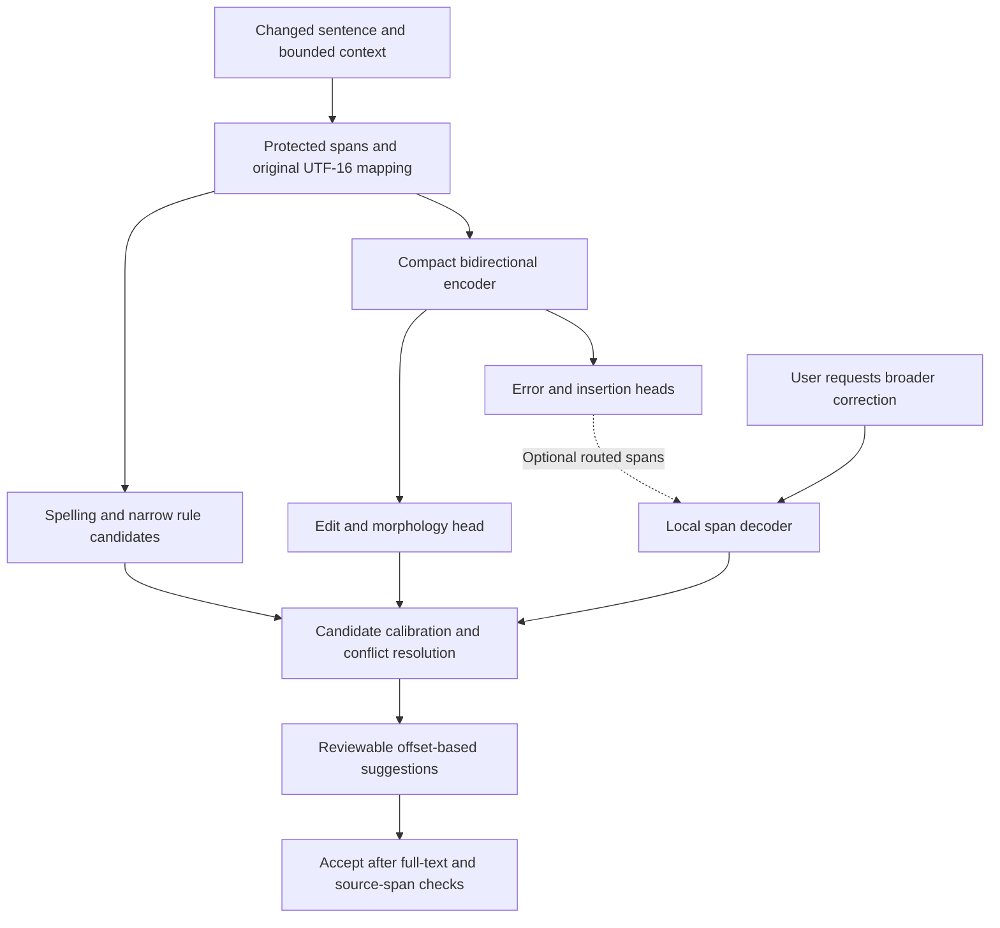

# Grammar correction: architecture literature review

Reviewed 2026-09-30. This is a targeted literature review for an English writing
assistant that runs locally in a browser, with a Chrome MV3 extension and a web
editor. It is a design recommendation, not a report of new training or benchmarks.

## Recommendation

For Gamma EH's inline checker, the strongest starting hypothesis is a compact
bidirectional Transformer with a richer edit representation, task-specific
distillation, and conservative edit calibration. Keep narrow spelling/rule
candidates and the existing safe, offset-based application layer. Compare
BERT-Mini and English MiniLM students against the current BERT-Tiny on the same
data and devices before selecting a backbone.

For broader corrections, evaluate a second, explicitly requested local mode that
generates replacement spans or a corrected sentence. EdiT5 and DeCoGLM motivate
generating only changed text; a conventional small encoder-decoder is an essential
baseline because it is simpler to train and export. Add an automatic decoder
cascade only if it earns enough recall at the same precision and fits the browser
latency and memory budget.

No reviewed study establishes the best architecture for this exact deployment.
The recommendation combines published evidence with engineering judgment. In
particular, good results from 300M–27B models do not establish the quality of a
10M–35M browser student, and accelerator timings do not predict browser latency.

## Scope and method

The review covers edit tagging, open-vocabulary span editing, encoder-decoder GEC,
LLM correction, distillation, evaluation, and browser execution. Searches used
variants of `grammatical error correction tagging`, `efficient grammatical error
correction`, `minimal-edit LLM`, `distillation`, and `ONNX Runtime Web performance`.
Primary papers and official runtime documentation were preferred. Key numerical
claims were checked against paper tables and experimental conditions. This is
not an exhaustive systematic review or a claim of a current leaderboard winner.

Separate three tasks when making a product decision:

- **Detection:** identify an error span without necessarily knowing its repair.
- **Minimal correction:** make necessary changes while preserving wording and meaning.
- **Fluency/style revision:** improve phrasing, sometimes changing grammatical text.

The BEA-2019 task explicitly evaluates both detection and correction with ERRANT.
Its correction metric requires the reference span and replacement to match;
detecting the right location does not by itself earn correction credit.
[BEA-2019 task](https://www.cl.cam.ac.uk/research/nl/bea2019st/).

## Current Gamma EH constraints

The [model card](../models/MODEL_CARD.md) records 4,377,793 parameters, two encoder
layers, width 128, 65 edit labels, 64 WordPieces, a 4.46 MB INT8 export, and a
17.55 MB FP32 export. Its evaluation is on synthetic template combinations, with
no BEA/CoNLL/JFLEG scores. Physical-GPU browser latency remains unverified.
Both browser backends execute the FP32 graph through JAX JS; the INT8 export
remains an evaluation artifact. See [JAX JS inference](jax-js-runtime.md).

The shipped schema-1 baseline has limits beyond model capacity. These describe
its existing vocabulary and training population; new edit infrastructure does
not expand the shipped weights without retraining and independent validation:

| Component | Present behavior | Consequence for quality |
| --- | --- | --- |
| [Alignment](../training/data.py) | Equal-length word replacements, deletions, or one appended token; no insertion before the first token | Many valid training pairs cannot be represented in one pass |
| [Preparation](../training/prepare_pairs.py) | Train-derived label vocabulary; unsupported examples are filtered | Evaluation on retained examples must also report dropped examples and whole-corpus coverage |
| [Tokenization](../packages/engine/src/tokenizer.ts) | Uncased WordPiece, sentence/window splits, no overlapping context | Case information is lost in model input; long-range dependencies can cross a window boundary |
| [Model suggestions](../packages/engine/src/model.ts) | Existing punctuation positions are skipped; APPEND always inserts a leading space | The shipped labels have no punctuation repairs; new punctuation edits also need explicit rendering support |
| Runtime guards | Article lexicon, duplicate-only deletions, protected-window skipping, and supported-subject agreement with verb family/tense preservation | These prevent known harmful edits but also reduce achievable recall |
| Training/evaluation | Original synthetic templates; development threshold selected on that domain | Excellent synthetic scores do not establish performance on ordinary drafts |

These facts make edit coverage and independent evaluation early priorities. They
do not prove which limitation contributes most to real-world errors; that needs
measurement. Increasing only the encoder cannot repair an unexpressible edit.

## What the literature establishes

| Primary source | Finding relevant to the design | Limits of transfer to Gamma EH |
| --- | --- | --- |
| [GECToR, BEA 2020](https://aclanthology.org/2020.bea-1.16/) | Parallel token tags, morphological transformations, and iterative refinement provide an efficient minimal-edit approach. Its coverage analysis separates representability from learned accuracy. | Large pretrained encoders and server GPU measurements; neither its scores nor its speed ratio apply to BERT-Tiny in a browser. |
| [PIE, EMNLP 2019](https://aclanthology.org/D19-1435/) | Parallel iterative edits model dependent corrections without generating every output token sequentially. | Refinement adds passes; results from full BERT encoders do not establish tiny-student quality or browser speed. |
| [Seq2Edits, EMNLP 2020](https://aclanthology.org/2020.emnlp-main.418/) | Open-vocabulary replacement spans avoid generating unchanged text; inference can depend on edit count. | Custom sequential edit decoding; reported CPU speedups depend on writer proficiency and edit density. |
| [EdiT5, Findings EMNLP 2022](https://aclanthology.org/2022.findings-emnlp.156/) | Parallel preservation/reordering followed by autoregressive insertion combines flexible edits with fewer decoding steps. | Smallest reported GEC model is 50M; latency is TPU device computation, not browser end-to-end time. |
| [DeCoGLM, ACL 2024](https://aclanthology.org/2024.acl-long.96/) | An integrated KEEP/ERROR/INSERT detector and localized autoregressive infilling support detection and correction within one backbone. | Main model is 335M and uses extensive synthetic pretraining; shrinking/exporting it is a separate experiment. |
| [EditScorer, EMNLP 2022](https://aclanthology.org/2022.emnlp-main.785/) | A second stage learns whether proposed elementary edits are correct, using proposals from tagging or generation. | Verification adds inference cost; a tiny shared-head substitute has not inherited the paper's demonstrated quality. |
| [Tagger ensembling and distillation, ACL 2022](https://aclanthology.org/2022.acl-long.266/) | Ensemble-generated correction pairs improve a single sequence tagger; training-time teachers can replace serving an ensemble. | The student is RoBERTa-Large, not a tiny model. Teacher errors can survive distillation. |
| [Efficient GEC, EMNLP 2023](https://aclanthology.org/2023.emnlp-main.355/) | Alignment-based auxiliary tasks and dataset scheduling deliver strong results with a 400M BART model. | “Smaller” is relative to 11B T5; the lesson concerns supervision and scheduling, not an established browser-size model. |
| [Prompting LLMs, Findings ACL 2024](https://aclanthology.org/2024.findings-acl.711/) | Ten LLMs on four benchmarks show that fluency correction and minimal-edit correction favor different behavior; generic prompting is not a universal improvement. | Models and prompts are a dated snapshot. This does not rule out newer, task-adapted LLMs. |
| [Adapting LLMs for minimal edits, BEA 2025](https://aclanthology.org/2025.bea-1.9/) | Task-specific training and clean-example scheduling improve the precision/recall tradeoff; adapted decoder-only models can be strong minimal-edit correctors. | The strongest systems are 9B/27B. Published benchmark success does not meet a modest browser package budget. |
| [ByT5, TACL 2022](https://aclanthology.org/2022.tacl-1.17/) | Byte inputs improve robustness to noise and spelling-sensitive tasks without a learned tokenizer. | Longer sequences increase inference cost; this is general evidence, not a matched English GEC comparison. |
| [Multi-dimensional GEC evaluation, May 2026 preprint](https://arxiv.org/abs/2605.07635) | Fine-tuning improves the tested LLMs, and correction, fluency, and meaning need separate measurement. | Supplementary evidence: arXiv preprint, BEA development and CoNLL test evaluation, not blind BEA-test results or browser-sized systems. |

### Edit coverage is a first-class quality metric

GECToR's Table 2 reports the share of CoNLL-2014 grammatical errors its operation
inventory can cover:

| Tag vocabulary size | Basic KEEP/DELETE/APPEND/REPLACE | Including transformations |
| --- | --- | --- |
| 100 | 60.4% | 79.7% |
| 1,000 | 76.4% | 92.9% |
| 5,000 | 89.5% | 98.1% |

These are oracle representational coverage numbers, not precision, recall, or a
prediction for Gamma EH's 65 labels. They motivate testing morphology, case,
split/merge, punctuation, and insertion operations before indiscriminately adding
word-specific replacement classes. The paper calls its method “Tag, Not Rewrite.”
[GECToR, Table 2](https://aclanthology.org/2020.bea-1.16.pdf).

### A useful comparison within one paper

EdiT5's GEC Table 4 compares models within a common experimental framework:

| Model | Parameters | BEA test ERRANT F0.5 | Published p95 computation |
| --- | --- | --- | --- |
| EdiT5 small | 50M | 68.40 | 1.3 ms |
| T5 small | 76M | 69.79 | 21.0 ms |
| EdiT5 base | 141M | 71.58 | 2.5 ms |
| T5 base | 248M | 72.39 | 74.1 ms |

The latency experiment uses a Cloud TPU V4 chip, batch one, and excludes
host/device transfers. It supports evaluating edit-only generation, while showing
a quality tradeoff in these configurations. It does not support a 1.3 ms browser
claim. [EdiT5, Table 4 and Appendix C](https://aclanthology.org/2022.findings-emnlp.156.pdf).

The 2025 minimal-edit LLM study reports BEA-test F0.5 of 77.41 for an adapted
Gemma 2 9B and 78.70 for its 27B version. This is evidence that architecture
families do not have an immutable quality ranking. Compare these as reported
results, not a controlled comparison with EdiT5: data, training, sizes, and
decoding differ. [Staruch et al., Table 7](https://aclanthology.org/2025.bea-1.9.pdf).

## Proposed architecture

### Inline model

1. **Share one encoder across detection and correction heads.** Predict error
   presence and insertion locations alongside edit operations. Do not add a
   separate full detector by default: its extra inference may outweigh savings.
   A detector head computed after the encoder only saves downstream decoding,
   not that encoder pass.
2. **Start with two compact backbone candidates.** Google's BERT-Mini is four
   layers at width 256; Microsoft's English MiniLM-L6-H384 is about 22M
   parameters. Both are plausible students, not demonstrated GEC winners.
   Use token-level pretrained encoders and fine-tune for edits, rather than
   substituting a pooled sentence-embedding output.
   [Google small BERTs](https://github.com/google-research/bert#pre-trained-models),
   [Microsoft MiniLM](https://raw.githubusercontent.com/microsoft/unilm/master/minilm/README.md).
3. **Audit a richer operation set.** Test 1k–5k frequent lexical edits plus
   deterministic morphology/case transformations, insertion before the first
   token, and punctuation operations. The suggested range is an experiment
   derived from the coverage evidence, not a fixed product requirement. Preserve
   case features explicitly if the encoder is uncased. Inflections need a valid
   lexicon or candidate generator; adding an `INFLECT` label alone is insufficient.
4. **Compare 64, 128, and 256 subword contexts.** Longer windows and overlapping
   context may help dependencies across boundaries; benchmark the added cost.
   Use context windows with a single authoritative emission region so overlapping
   windows do not propose duplicate edits.
5. **Start with one pass.** Ablate a maximum of two internal refinement passes,
   train on intermediate correction states, stop on unchanged output, and reject
   cycles. Later-pass edits must be mapped
   back to the original draft before presentation; mutated intermediate offsets
   cannot be applied directly to live text.
6. **Treat confidence as a calibrated decision.** Compare thresholds and KEEP
   biases on independent development data by edit category, then recalibrate each
   quantized export. Add a verifier only if it improves the measured tradeoff.
   A large softmax score by itself is not evidence that an edit is correct.

### Broader correction mode

Evaluate an EdiT5-like copy/edit decoder or a DeCoGLM-like infiller against a small
conventional encoder-decoder. These are architectural inspirations, not promises
that either paper's checkpoint can be dropped into the existing browser engine.
Generate only replacement spans when possible, bound decoding, and include an
identity/copy outcome. A detector can miss errors; show its routing recall and
compare against an ungated corrector before enabling a cascade.

For a desktop target with a much larger memory budget, also evaluate a
task-adapted decoder-only model. Raw weight storage alone is approximately 500 MB
for 1B parameters at 4 bits and 4.5 GB for 9B, before metadata, unquantized tensors,
runtime buffers, and caches. These are arithmetic estimates, not package sizes or
measured memory. A browser deep mode needs its own model, export, and device study.

Expose fluency/style revision separately from grammar repairs. Derive reviewable
edits from generated text using alignment; reject ambiguous/conflicting edits and
validate the analyzed snapshot before application. Use curated explanations for
known grammar categories first; unverified generated explanations can be wrong.

## Training and evaluation

Use broad synthetic correction pairs or teacher predictions for pretraining,
followed by task/domain adaptation on independently reviewed real correction
pairs where rights permit. Include substantial clean text, names, code-adjacent
prose, idioms, dialect variants, and valid constructions that resemble errors.
Measure the clean/error balance rather than copying another paper's ratio.

The curriculum and distillation evidence supports this workflow, but does not
establish its result at our model size. Preserve existing split-before-corruption
and provenance safeguards; add document/source grouping and near-duplicate checks.
Keep unreviewed teacher data out of development and test sets. Google's C4_200M
repository explicitly licenses its **corruption edits** under CC BY 4.0; track
underlying-text provenance separately. cLang-8 is explicitly CC BY-NC-SA 4.0, so
the training conditions used by research papers are not automatically our release
conditions. [C4_200M](https://github.com/google-research-datasets/C4_200M-synthetic-dataset-for-grammatical-error-correction),
[cLang-8](https://github.com/google-research-datasets/clang8).

Evaluate on two tracks:

- **Research comparability:** unfiltered BEA/W&I and CoNLL evaluation, with the
  exact scorer, track, tokenization, and split recorded; JFLEG GLEU for a separate
  fluency objective, subject to dataset access and terms.
- **Product validity:** an independently reviewed set of fictional or properly
  licensed drafts across email, chat, essays, and technical writing, with
  substantial clean text and multiple valid corrections where needed.

Report edit precision, recall, F0.5, detection quality, false edits per 1,000 clean
tokens, clean-sentence false-positive rate, and per-error-category performance.
Review meaning changes, names/numbers, dialect handling, and unnecessary style
changes. Bootstrap by document for uncertainty. Score both the neural model and
the final rule/guard pipeline; report unsupported edit coverage on the full set.
Never silently remove examples to make a finite tagger appear more capable.

## Browser performance

Use the current [JAX JS FP32 WASM/WebGPU pipeline](jax-js-runtime.md) as the
baseline, preserving bundled assets, workers, the MV3 offscreen owner, and
stale-text checks. Measure both backends on representative devices; WebGPU
availability does not establish lower latency.

Recommended engineering experiments:

- Compare FP32 WASM and WebGPU on the same graph first. Evaluate INT8 or FP16
  only with a runtime and graph that support the required operators, then
  validate edit quality and recalibrate each export.
- Keep sessions warm; schedule only changed windows, debounce edits, and discard
  stale queued requests. Use bounded scheduling across fields and tabs.
- Profile the expanded classifier head and output transfer. At 128 positions and
  4,096 labels, FP32 logits alone are approximately 2.1 MB. Explore exporting
  compact decisions/scores rather than reading every logit into JavaScript if the
  target backends support the needed graph and calibration computations.
- Record cold initialization, tokenization, queue wait, inference, transfer,
  merging, and input-to-suggestion p50/p95 separately. Include model/runtime
  package bytes, steady/peak CPU and GPU memory, and sustained typing behavior.
- Use actual integrated and discrete GPUs plus CPU fallback on representative
  machines. Label software adapters explicitly; existing SwiftShader execution
  establishes function, not physical-GPU speed.

For a rough storage comparison, 22M weights need about 22 MB at INT8 or 44 MB at
FP16 before graph overhead and mixed-precision tensors. Bundling both variants
adds their sizes; tokenizer/runtime files and in-memory copies add more. Select
the final deployment budget from measured complete packages and runtime memory.

## Experiment sequence and decision rule

Run training/export/browser jobs sequentially. Fix the unfiltered evaluation set
first, freeze test access, and use development data to choose thresholds.

| Step | Controlled comparison | Decision it answers |
| --- | --- | --- |
| 1 | Rules-only and shipped tiny model on the same independent set; oracle edit coverage | Where do current false positives and representational misses occur? |
| 2 | BERT-Tiny, current versus broader supervision, same ontology/context | How much can better data buy without more inference cost? |
| 3 | BERT-Tiny, basic versus richer edit ontology, same data/context | Does representational coverage translate into useful recall? |
| 4 | Tiny, BERT-Mini, MiniLM-L6; same supervision, ontology, and context | Which encoder offers the best measured precision/recall/latency frontier? |
| 5 | Winning encoders at 64/128/256 context, then one/two passes and per-category calibration | Are longer context and refinement worth their cost? |
| 6 | Small full-sequence decoder versus span decoder; ungated versus gated | Does a second mode or cascade add enough useful coverage? |
| 7 | Final exported pipelines on the device matrix, including CPU fallback | Which complete artifact fits the actual product budget? |

Compare recall at matched edit precision and clean-text false-positive limits,
alongside F0.5. A proposed starting target is 95% edit precision and at most 1%
clean-sentence false positives on the product development set, subject to review
of harmful edits and confidence intervals. These are planning gates, not achieved
scores. If no model qualifies, retain opt-in neural suggestions and report the
quality gap instead of weakening the gate silently.

Use a quality/latency/package/memory Pareto frontier rather than naming a winner
from parameter count or a cross-paper leaderboard. The first implementation
candidate is **broader supervision plus richer edits on a compact encoder**.
The span decoder remains a measured follow-up; none of these model changes is
implemented by this literature review.
