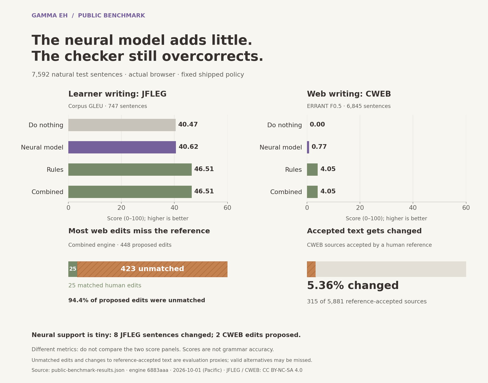

# Public natural-writing benchmark



[Download PNG](assets/benchmark-overview.png) ·
[Download scalable SVG](assets/benchmark-overview.svg) ·
[Figure provenance](assets/benchmark-figures.json)

Measured on 2026-10-01 (America/Los_Angeles; receipt timestamps are UTC), using
engine snapshot `6883aaa87a0fa7d1151a829875ff1d95d1872f86` and the existing
`gamma-eh-tiny-edit-v1` weights. **The model remains experimental.** It adds no
correction benefit over rules on these populations, while the full engine makes
many unnecessary corrections on low error density web writing.

[Machine-readable results](public-benchmark-results.json) record population,
model, code, executed bundle and scorer hashes/versions. The
[dataset research](gec-datasets.md) explains other evaluation and training options.

## JFLEG: human learner-writing corrections

All **747 test sentences and all four references** were scored with the pinned
[official JFLEG scorer](https://github.com/keisks/jfleg/blob/ee06ff806a208aba815ac45313f4e750a48330a5/eval/gleu.py).
GLEU below is corpus GLEU on a 0–100 scale, not percent grammar accuracy.

| System | Official GLEU | Sources changed | Reference-accepted sources changed |
| --- | ---: | ---: | ---: |
| Unchanged input | 40.47 | 0/747 | 0/182 |
| Rules and dictionary | 46.51 | 253/747 | 2/182 |
| Guarded neural model | 40.62 | 8/747 | 0/182 |
| Combined engine | 46.51 | 253/747 | 2/182 |

The neural model improves GLEU by only 0.15 points over unchanged input. Under
the earlier custom best-sentence-reference ERRANT diagnostic, it matches seven
of eight edits, with **0.47% recall**. This tiny edit count cannot establish
broad precision. Combined outputs equal rules exactly for every test sentence.

The upstream corpus scorer averages 500 seeded reference selections and uses
whitespace tokenization and fourgrams. Its reported standard deviation and
95% interval describe random reference-selection variation, **not a confidence
interval over the writing population**. The unchanged baseline was recomputed
in the same environment; no leaderboard baseline was copied.

JFLEG's fluency targets include stylistic rewrites. It has also been measured in
earlier Gamma EH quality and decoder studies: this rerun is a public comparison
on a known benchmark, not a newly blind test. This run did not train weights,
select a checkpoint, or tune thresholds or guards. Gold was never added to
training.

## CWEB: low error density web writing

All **6,845 test sentences** were retained: CWEB-G 3,981 and CWEB-S 2,864.
The two original annotators' combined M2 files were scored with standard
[ERRANT](https://github.com/chrisjbryant/errant) **3.0.2** span correction, using
the default multiannotator comparison. Inputs preserve the original tokenization
and edit coordinates. Precision, recall and F0.5 are on a 0–100 scale.

| System | Precision | Recall | F0.5 | Matching / unmatched edits | Reference-accepted sources changed |
| --- | ---: | ---: | ---: | ---: | ---: |
| Unchanged input | — | 0.00 | 0.00 | 0 / 0 | 0/5,881 |
| Rules and dictionary | 5.58 | 1.93 | 4.05 | 25 / 423 | 315/5,881 (5.36%) |
| Guarded neural model | 100.00* | 0.15 | 0.77 | 2 / 0 | 0/5,881 |
| Combined engine | 5.58 | 1.93 | 4.05 | 25 / 423 | 315/5,881 (5.36%) |

\* Neural precision rests on **two predicted edits**. It misses 1,292 reference
edits and fails the existing minimum-support requirement for a reliability
claim. The unchanged baseline makes no predictions; the scorer's vacuous
precision value is retained in JSON but shown as a dash here.

Rules/combined changed 406 sentences, including 315 accepted unchanged by at
least one annotator. Their corrected text is identical on every sentence.
The sharp difference from JFLEG exposes a domain-generalization problem in the
full engine. It cannot be advertised as reliable general English correction.
This measurement does not isolate the individual rule or dictionary changes
needed to fix it. Human inspection and independent development data are next.

The [original CWEB study](https://aclanthology.org/2020.emnlp-main.680/) motivates
evaluating restraint on low error density text. Our score uses the recorded
ERRANT version rather than claiming identical historical scorer conditions.
ERRANT's best-reference selection depends on the hypothesis, so its selected
gold edit totals can differ slightly across systems.

## Execution and interpretation

The actual shared browser engine ran through JAX JS **FP32/WASM** in headless
Chromium 149.0.7827.55. The deployed threshold remained **0.85**, with the
existing guards and one correction pass. Neural-only retains deployment guards;
it is not a score of unfiltered classifier logits. Rules mode includes the
local spelling dictionary. Combined mode applies the public engine's rule
priority and guarded neural suggestions.

There were **22,776 predictions**, zero startup/inference failures, zero blocked
external requests, and 24 unchanged protected-content canaries outside the
scoring populations. No rows were dropped for vocabulary, alignment, context
limits, inference, or correctness. Abstentions remain in the denominator.
The publication step rejects failures, partial populations, changed references,
wrong source/ID order, duplicate conditions, and mismatched model/code/bundle
provenance across datasets.

The JSON includes local startup and sentence latency observations for audit,
but these are not hardware WebGPU benchmarks. Conditions reuse a browser and
compiled inference shapes; each dataset starts a fresh browser. These timings
do not establish physical-GPU performance or cross-device latency.

“Reference-accepted” means the source matches at least one human reference after
NFC and whitespace normalization, preserving case. Changing such a sentence is
an overcorrection proxy, not proof every change is invalid. Automatic edit
matching can also penalize valid alternatives. These limits warrant human
review; they do not excuse the observed false-edit and recall gaps.

JFLEG and CWEB are separately licensed **CC BY-NC-SA 4.0**. This is a
noncommercial research evaluation. Inputs, references, upstream scorer code,
and sentence-level browser predictions remain in ignored local directories;
they are not redistributed in the app, training data, or this report.

## Reproduce

Use Node 24.x, Python 3.10, and the repository revision containing this report.
Its engine matches the measured snapshot. The aggregate includes exact source,
lockfile, model and bundle hashes because a newer engine may produce different
results. The added runner/scorer files are
identified separately from their base commit. Run heavy commands sequentially.

```sh
npm ci
npx playwright install chromium
uv venv --python 3.10 .venv-benchmark
uv pip install --python .venv-benchmark/bin/python -r training/requirements-benchmark.txt

# Download bounded, pinned evaluation files and the hash-checked upstream scorer.
# Review the datasets' noncommercial terms before executing the download.
.venv-benchmark/bin/python training/public_benchmark.py prepare --execute

node scripts/evaluate-browser.mjs \
  --input data/imported/public-benchmark/jfleg/test.jsonl \
  --output artifacts/public-benchmark/jfleg-test.json --passes 1
node scripts/evaluate-browser.mjs \
  --input data/imported/public-benchmark/cweb/test.jsonl \
  --output artifacts/public-benchmark/cweb-test.json --passes 1

OMP_NUM_THREADS=4 OPENBLAS_NUM_THREADS=4 MKL_NUM_THREADS=4 \
  .venv-benchmark/bin/python training/public_benchmark.py score \
  --evaluation-dir data/imported/public-benchmark \
  --jfleg-report artifacts/public-benchmark/jfleg-test.json \
  --cweb-report artifacts/public-benchmark/cweb-test.json \
  --output artifacts/public-benchmark/results.json
```

Preparation defaults to a dry run without `--execute`. Downloaded upstream
GLEU code is hash-checked and executed only by the isolated evaluation process;
it is never browser runtime code. Existing data/report paths are not overwritten.
Choose fresh paths for a new run. The completed run used
`data/imported/public-benchmark-v2`; output JSON is deterministic except measured
timestamps/timings and machine-specific execution provenance.

Dataset pins: JFLEG `ee06ff806a208aba815ac45313f4e750a48330a5`, CWEB
`08d1da0ff2b78885b1f060b4fa11460a98eb9218`. CWEB credits Simon Flachs, Ophélie
Lacroix, Helen Yannakoudakis, Marek Rei and Anders Søgaard (2020). JFLEG credits
Courtney Napoles, Keisuke Sakaguchi and Joel Tetreault (2017).

The figure is generated from the aggregate receipt, with no hand-entered scores:

```sh
uv pip install --python .venv-benchmark/bin/python -r training/requirements-plots.txt
MPLCONFIGDIR=artifacts/matplotlib .venv-benchmark/bin/python training/plot_benchmark.py
```

Both PNG and scalable SVG exports are published. The SVG retains readable text
and an accessible description. The figure manifest records input, renderer and
export hashes; timestamps are excluded from the image bytes for reproducibility.

Before proposing a new model, improve licensed human supervision and independent
development controls, then qualify both neural and combined behavior. Continue
to require development precision, clean-text preservation, and adequate edit
support. Retain new unseen evaluation data for the next release decision.
