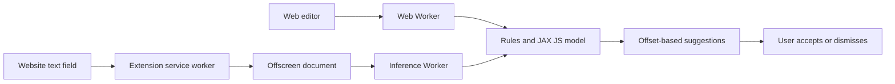

# Research and architecture

Runtime migration checked 2026-09-30. Gamma EH is an independent English writing assistant;
it is not affiliated with Grammarly. The first implementation runs entirely on
the user's device and proposes edits for the user to accept.

For the next model decision, see the [grammar correction literature review](gec-literature-review.md)
(2026-09-30). It compares edit tagging, span generation, and LLM correction, and
proposes controlled quality/performance experiments. Those recommendations are
not changes to the currently shipped model or measured browser performance.

## Browser runtime research

| Project | What it provides | Decision |
| --- | --- | --- |
| [Transformers.js v4](https://huggingface.co/blog/transformersjs-v4) | New ONNX WebGPU runtime, many model architectures, optimized BERT attention exports, independent tokenizers | Relevant reference and future higher-level model integration; current npm version checked was 4.3.0 |
| [Hugging Face WebGPU kernels](https://huggingface.co/blog/webgpu-kernels) | 207 versioned WGSL operation packages and a preview kernel loader | Useful for profiling and future operator optimization. A kernel library is not a complete trained correction model; do not fetch executable kernels into the MV3 extension |
| [JAX JS](https://github.com/ekzhang/jax-js) | JIT-compiled array operations through WebGPU or WASM; ONNX graph loading | Selected: `@jax-js/jax` 0.1.25 and `@jax-js/onnx` 0.1.2, bundled locally |
| [WebLLM](https://github.com/mlc-ai/web-llm) | WebGPU execution of generative language models | Candidate for an optional later rewrite assistant; generative model size and latency are less suitable for the first tiny inline checker |

The kernel announcement's benchmark uses particular shapes and an Apple M4. Its
speedups do not establish Gamma EH performance; our model must be measured on
supported target browsers. GPU initialization can also cost more than inference
for a tiny encoder. The implementation prefers WebGPU but falls back to WASM
when no GPU is available or initialization fails.

## Model architecture

[GECToR](https://aclanthology.org/2020.bea-1.16/) predicts local edit tags instead
of generating whole rewritten sentences. We implement this pattern independently
with a token classification head on Google's pretrained
[BERT-Tiny](https://github.com/google-research/bert#pre-trained-models), using
[google/bert_uncased_L-2_H-128_A-2](https://huggingface.co/google/bert_uncased_L-2_H-128_A-2)
at revision `30b0a37ccaaa32f332884b96992754e246e48c5f` (Apache-2.0).

Two encoder layers, hidden width 128, two attention heads, and roughly 4.4M
parameters are substantially smaller than BERT-Base. The vocabulary embedding
accounts for most of the size. The correction head predicts `KEEP`, `DELETE`,
`REPLACE:word`, and `APPEND:word`. Supervision is attached only to the first
WordPiece of each original word. The browser implements the same BERT uncased
WordPiece processing, keeping the original UTF-16 offsets independently.

This first tag set is deliberately finite: it cannot invent arbitrary words,
reorder clauses, explain style, or perform a general fluent rewrite. A future
student can use MiniLM or BERT-Mini if experiments establish that quality gains
justify more memory and latency. A larger teacher may produce additional
training pairs, but synthetic labels need review and independent evaluation.

## Runtime flow

Both consumers share `packages/engine`. Rules offer a precise baseline for
known misspellings, narrow pronoun agreement, and duplicate tokens. Model
inference splits at sentence boundaries and within long sentences to fit the
checkpoint context budget. Oversized individual tokens are skipped. Sentence
chunks lose context across windows; this is a stated baseline limitation.

Spelling lookups accept only dictionary-owned entries. JavaScript prototype
names such as `constructor` and `__proto__` therefore cannot become spelling
replacements. In rules-only checks, `Constructor`, `CONSTRUCTOR`, and
`constructor` remain unchanged while known misspellings retain their case;
`canonicalSpelling` applies the same lookup rule. Focused engine regression
tests cover both paths.

Input is capped at 20,000 characters in the engine and 6,000 per extension field
to bound CPU work. Concurrent workers run inference away from the UI thread.

Use FP32 ONNX through JAX JS on both WebGPU and WASM. The INT8 export remains
an evaluation artifact; the JAX loader does not support its quantized operators. Both exports
are evaluated after training. A threshold is selected on the development split
and recorded in the model manifest. Rules take priority over overlapping model
edits. Every accepted change checks source offsets against the current text;
the UI additionally checks the complete analyzed draft to prevent stale edits.

Browser validation exposed an article false positive on a misspelled noun. The
v1 engine consequently accepts model article edits only for a small known
sound-class lexicon, with spelling normalization and exceptions such as
hour/university. It suppresses unknown article heads rather than applying a
first-letter vowel heuristic. Reported model tag metrics predate this runtime
guard and describe the neural classifier alone, not the complete engine.
The runtime also restricts deletion tags to adjacent duplicates and skips model
inference in sentence windows containing protected code/URLs or a rule-driven
deletion. Natural-text smoke tests exposed out-of-domain false suggestions, so
Local AI is an explicit experimental toggle, disabled by default until broader
training and independent evaluation justify enabling it automatically.

## Extension boundaries

[MV3 CSP](https://developer.chrome.com/docs/extensions/reference/manifest/content-security-policy)
allows bundled WebAssembly with `wasm-unsafe-eval`. Runtime JavaScript, tokenizer, and weights are bundled in the extension build;
JAX generates its WASM kernels locally. There is no CDN
execution, inference endpoint, account requirement, or text telemetry.

The service worker routes requests to an
[offscreen document](https://developer.chrome.com/docs/extensions/reference/api/offscreen),
which owns a dedicated Worker and outlives popup closure. Manifest-declared
content scripts run automatically on HTTP and HTTPS pages in the top frame.
The popup stores per-site pauses locally and can pause suggestions everywhere;
the content script and service worker both enforce those preferences. Settings
changes invalidate pending suggestions in existing tabs. Local AI stays opt-in.
Updates remove the older persisted per-site script registrations; existing tabs
need one reload after the extension is updated. Chrome's native site-access
controls still apply. The checker handles ordinary textarea and plain
contenteditable fields and rejects password/payment-sensitive fields and rich
DOM editors it cannot edit safely. This does not imply support for Google Docs,
every rich editor, iframes, or shadow-root editors.

See [JAX JS inference](jax-js-runtime.md) for runtime ownership, FP32 parity,
GPU failure fallback, and package size details.
