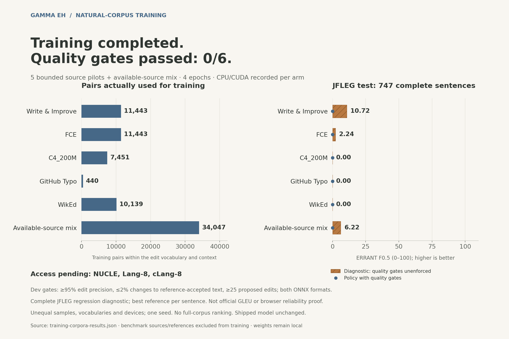

# Natural-corpus training results

**Five source pilots and their combined model completed four epochs. None of
the six candidates passed the export quality gate.** This training does not
promote a candidate into the extension or publish weights. NUCLE, Lang-8 and
cLang-8 have prepared integrations but still need authorized inputs.



[Accessible SVG](assets/training-corpora-overview.svg),
[aggregate measurements and hashes](training-corpora-results.json),
[figure checksums](assets/training-corpora-figures.json).

## Completed training

| Source | Imported pairs, including clean controls | Pairs actually trained | Device | Diagnostic test F0.5 (0–100) | Proposed edits | Quality gate |
| --- | ---: | ---: | --- | ---: | ---: | --- |
| Write & Improve | 11,715 | 11,443 | CUDA | 10.72 | 71 | Failed |
| FCE | 11,633 | 11,443 | CUDA | 2.24 | 17 | Failed |
| C4_200M corruptions | 12,408 | 7,451 | CUDA | 0.00 | 0 | Failed |
| GitHub Typo | 440 | 440 | CPU | 0.00 | 0 | Failed |
| WikEd | 11,622 | 10,139 | CPU | 0.00 | 0 | Failed |
| Available-source mix | 47,818 before joint filtering | 34,047 | CPU | 6.22 | 27 | Failed |

Every arm starts a fresh classifier on `google/bert_uncased_L-2_H-128_A-2`,
pinned at `30b0a37ccaaa32f332884b96992754e246e48c5f`: four epochs, seed 42,
batch 32, context 128, AdamW learning rate 0.0005 and KEEP loss weight 0.3.
Vocabulary is learned separately per arm, capped at 4,096 labels (GitHub: 234).
The 4,096-label models have 4,897,792 parameters. Development evaluation selects
the checkpoint and threshold; test does not select either.

The mix removes duplicates, conflicting sources, examples outside the edit
representation, and 13,157 examples outside its label vocabulary. This leaves
34,048 prepared pairs; one exceeds the context token budget. The receipt records
each filtering stage. More imported data did not produce a qualified model
under this fixed representation and schedule.

| Arm with diagnostic test edits | Correct | Incorrect | Precision | Recall | Reference-accepted sources changed |
| --- | ---: | ---: | ---: | ---: | ---: |
| Write & Improve | 39 | 32 | 54.93% | 2.54% | 9 / 182 (4.95%) |
| FCE | 7 | 10 | 41.18% | 0.47% | 2 / 182 (1.10%) |
| Available-source mix | 20 | 7 | 74.07% | 1.33% | 4 / 182 (2.20%) |

The orange diagnostic scores use the development-selected unconstrained
threshold, retaining decoder safeguards. These are research scores with the
quality gate unenforced. The guarded policy has **F0.5 0.00 for every arm**:
failed candidates export `disableModelEdits: true`. The evaluator assigns
precision 1.0 when no edits are proposed, so that number alone is not evidence
of a useful model.

Development gates require **95% edit precision**, at most **2% changes to
reference-accepted sources**, and at least **25 proposed edits**, for both
FP32 and INT8. The mix's best development diagnostic proposes 19 edits at
84.21% precision, changing 1 / 216 reference-accepted sources. W&I fails
precision and clean-text protection; FCE fails precision/support; the other
three propose no diagnostic edits. Calibration finds no qualifying policy.

## Evaluation and limits

All **754 JFLEG development sentences** and **747 test sentences** are evaluated,
including corrections outside the edit vocabulary. This uses ERRANT 3.0.2 and
en-core-web-sm 3.8.0 with sentence-wise best-reference F0.5. Reference choice can
change reference-edit totals across predictions. These custom diagnostics are
separate from official JFLEG GLEU and original-gold CWEB ERRANT in the
[public benchmark](public-benchmark.md). JFLEG was already used in earlier
project studies; this is regression evaluation, not a newly blind test. These
candidates have not undergone the public browser benchmark.

Imports exclude raw and canonical keys of reserved JFLEG/CWEB sources and
references. Five W&I and nine FCE records were excluded for overlap before
selection. The final audit checks every retained pair against **31,265 reserved
keys**, finding zero exact/canonical overlaps. Near-duplicate absence is not
established. CWEB is reserved for later evaluation, not threshold selection.

Sampling is seeded selection from bounded prefixes, not a uniform full-corpus
sample. W&I scans 34,308 records; FCE 28,350; C4/WikEd 50,000 each; GitHub 500
rows from five documentation repositories. WikEd uses a 16 MiB compressed
archive prefix; its hash identifies that prefix, not the full archive. Unequal
samples/vocabularies, one seed and mixed devices do not support a causal corpus
ranking or a full-corpus quality claim.

Three arms complete on RTX 3070 CUDA. Initialization then fails before the first
GitHub update: PyTorch and direct `cuInit(0)` both fail, the latter returning
`CUDA_ERROR_NOT_INITIALIZED` (3). The shared GPU is not reset; the cause remains
unestablished. The original receipt is retained; only unfinished GitHub, WikEd
and mix arms run in a fresh CPU receipt, sequentially with four PyTorch threads.
Completed CUDA results are not relabeled or silently rerun.

All arms export FP32/INT8 ONNX and report zero evaluation inference failures.
Disabled-policy export parity fields do not establish active correction parity
or browser reliability. Typed-text handling, UTF-16 offsets and browser runtime
behavior are outside these experiments.

## Source PRs and rights

| Source | Separate PR | Status |
| --- | --- | --- |
| [Write & Improve](training-sources/wi.md) | [#28](https://github.com/thapecroth/gamma_eh/pull/28) | Trained; restricted source terms |
| [FCE](training-sources/fce.md) | [#29](https://github.com/thapecroth/gamma_eh/pull/29) | Trained; restricted source terms |
| [NUCLE](training-sources/nucle.md) | [#30](https://github.com/thapecroth/gamma_eh/pull/30) | Draft; authorized archive missing |
| [Lang-8](training-sources/lang8.md) | [#31](https://github.com/thapecroth/gamma_eh/pull/31) | Draft; authorized archive missing |
| [cLang-8](training-sources/clang8.md) | [#32](https://github.com/thapecroth/gamma_eh/pull/32) | Draft; original input/aligned English TSV missing |
| [C4_200M](training-sources/c4.md) | [#33](https://github.com/thapecroth/gamma_eh/pull/33) | Trained; original web-text rights unreviewed |
| [GitHub Typo](training-sources/github-typo.md) | [#34](https://github.com/thapecroth/gamma_eh/pull/34) | Trained; file-level rights unreviewed |
| [WikEd](training-sources/wiked.md) | [#35](https://github.com/thapecroth/gamma_eh/pull/35) | Trained; historical share-alike review pending |

[Pipeline PR #27](https://github.com/thapecroth/gamma_eh/pull/27) contains the
importer, provenance handling, exclusions, training lock, sequential runner and
resume validation. This report integrates the source PRs and combined results.
The three missing-input sources are neither imported nor trained.

GitHub's audit checks 331 originating commits, verifies 259 root licenses and
excludes unverified examples. Root proof does not settle file exceptions;
mirror licenses do not override original rights. All prepared datasets and
exports retain `publication_allowed: false`. Corpus text, contributor metadata,
checkpoints, labels and weights remain Git-ignored. Public artifacts contain
code, attribution and aggregate results.

## Reproduce

Experiments use the frozen
[CUDA revision](https://github.com/thapecroth/gamma_eh/tree/8d97e2af2a77c46ef3cb2391c29035fa896cbb20)
and [CPU continuation](https://github.com/thapecroth/gamma_eh/tree/a967f536ab3cb92911209b5d17d3911543cafa45).
These share processing/training/evaluation dependency hashes; the continuation
adds selection of unfinished arms. Receipts include both plans, source/code/
evaluation hashes, devices, versions, prepared splits and model identities.
Current main's teacher/app changes are preserved by integration but are not
the implementation executed for these frozen measurements.

Follow [the training workflow](training-corpora.md) and source pages using the
frozen JFLEG/CWEB inputs. Then verify the retained local receipts and render:

```sh
python training/summarize_corpora.py \
  --run artifacts/corpus-training/run-001 \
  --run artifacts/corpus-training/run-002-cpu \
  --reserved jfleg=data/imported/evaluation-corpus-training \
  --reserved cweb=data/imported/cweb-heldout
python training/plot_corpora.py
```

The summarizer checks model assets, actual versus planned code/evaluation/
device/scorer identities, prepared inputs, complete populations and final
heldout exclusion. It refuses incomplete/incompatible receipts. The pinned
`training/requirements-plots.txt` toolchain renders deterministic PNG and
accessible SVG from the same receipt. A newly generated aggregate timestamp
changes its checksum; the retained artifact identifies this publication.

Next work needs the three authorized inputs, a broader representation/vocabulary
strategy, and controlled ablations with comparable samples and repeated seeds.
Promotion requires development gates plus actual browser/natural verification.
